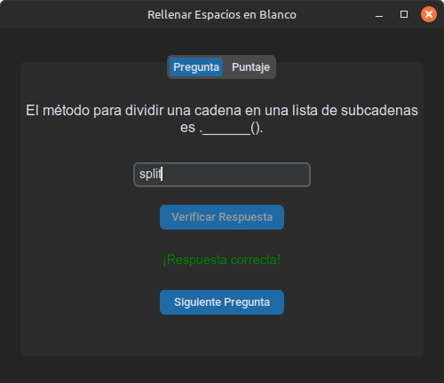
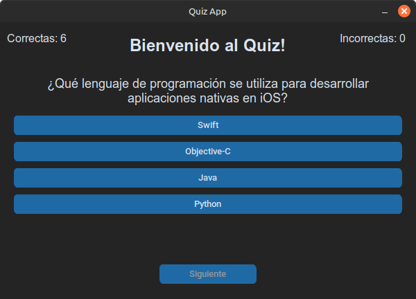

# Mini Proyectos con CustomTkinter
Basado el el tutorial y algo mas de la documentacion oficial de CustomTkinter
----
## 1. Blank Space Game
### Descripción
Rellena los espacios en blancos, los espacios en blancos son propiedades,metodos y palabras reservadas de Python3 y CustomTkinter.

### Requisitos
- Python 3.x
- CustomTkinter

## 2. Quiz Game
### Descripción
Juego de preguntas y respuestas, el usuario debe responder correctamente a las preguntas para ganar.

### Requisitos
- Python 3.x
- CustomTkinter
